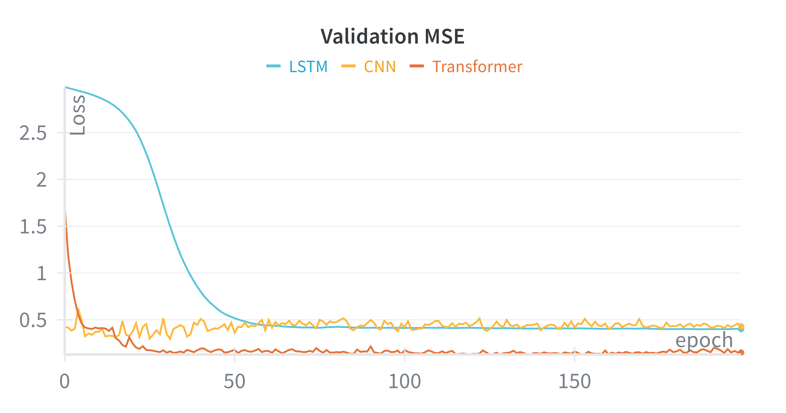
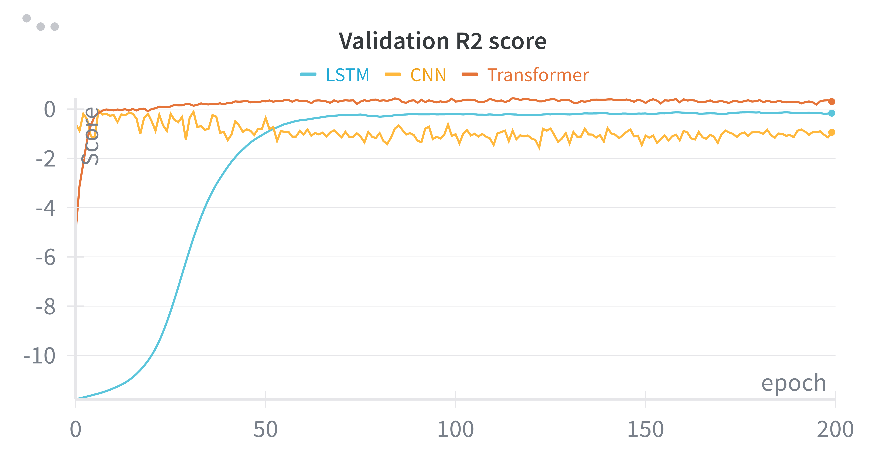
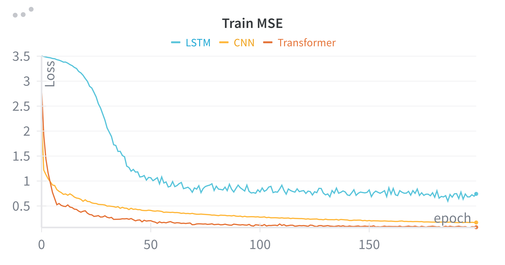
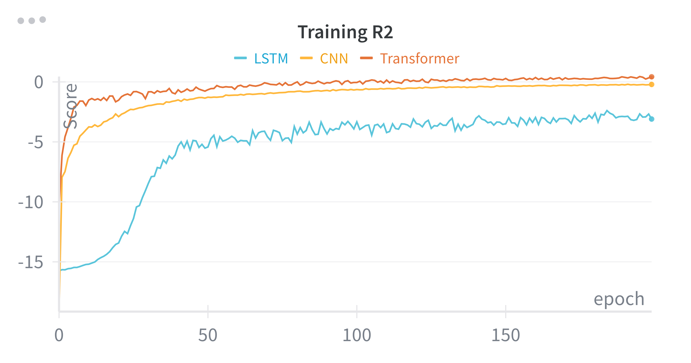

#  Double Pendulum Inverse Problem

## Predicting Physical Parameters from Chaotic Motion Trajectories using Deep Learning


## Project Overview

This project investigates how neural network architectures can **predict the initial physical parameters of a double pendulum system** from its **observed trajectories**.  
The parameters to be estimated include:

- **L₁**, **L₂** → Lengths of the two pendulum arms  
- **m₁**, **m₂** → Masses of the two bobs  
- **k** → Spring constant  

By analyzing simulated motion data, the models aim to infer these governing parameters, effectively solving a **physics-based inverse problem**.


## Motivation and Significance

In natural sciences, motion trajectories often encode hidden physical parameters such as mass, length, and spring constants.  
Extracting these parameters from observed motion is a **challenging inverse problem**, particularly for **chaotic systems** like the double pendulum—where minimal variations in parameters can lead to vastly different dynamics.

This project explores how modern **deep learning architectures** (CNN, LSTM, Transformer) can approximate such inverse mappings, demonstrating their potential for **data-driven physical inference**.


## Input Data

Two different data representations were used for model training:

- **Time-series trajectories** → (`x₁, y₁, x₂, y₂`) used for **LSTM** and **Transformer** models  
- **Trajectory images** → used for the **CNN** model  

The dataset was **synthetically generated** through simulations of the double pendulum with known parameter sets, which serve as **ground truth** for comparison during evaluation.

---

## Methodology and Training Setup

All models were implemented using the **Lightning** framework for reproducible and modular training.  

- **Framework:** Lightning  (Pytorch)
- **Dataset Split:** 80% Training | 10% Validation | 10% Testing  
- **Loss Function:** Mean Squared Error (MSE)  
- **Optimization:** Adam optimizer  
- **Metrics:** Mean Squared Error (MSE) and R² Score  
- **Logging:** TensorBoard and Weights & Biases (W&B)

Separate models were trained for each data representation:
- **CNN** → image-based trajectory learning  
- **LSTM** → sequential time-series learning  
- **Transformer** → attention-based time-series learning  

---

## Model Architectures

### Convolutional Neural Network (CNN)
- Input: Trajectory images  
- Goal: Regress continuous values for L₁, L₂, m₁, m₂, and k  
- Architecture: Stacked convolutional layers with fully connected regression head

###  Long Short-Term Memory (LSTM)
- Input: Sequential coordinates (x₁, y₁, x₂, y₂)  
- Captures temporal dependencies in the motion

### Transformer
- Input: Same as LSTM  
- Employs self-attention mechanism to capture long-range dependencies within trajectory sequences

---

##  Evaluation and Results

Performance of the models was assessed using **MSE** and **R² score** on the test set.

| **Model**   | Test $R^2$  | **Test MSE** |
| :-----------: | :---------------: | :------------: |
| CNN         | -15.681         | 3.461        |
| LSTM        | -0.386          | 0.354        |
| Transformer | 0.415           | 0.126        |


# Important Results

   

###  Predictions vs Ground Truth


Comparison between ground truth and predicted double pendulum parameters

### LSTM Model Prediction

| gt_L1    | gt_L2    | gt_m1    | gt_m2    | gt_k     | pred_L1   | pred_L2  | pred_m1  | pred_m2  | pred_k   |
| -------- | -------- | -------- | -------- | -------- | --------- | -------- | -------- | -------- | -------- |
| 2.403437 | 2.976437 | 0.866370 | 0.507046 | 1.286184 | -0.073568 | 0.116787 | 0.101633 | 0.041389 | 0.119936 |
| 2.200069 | 2.999577 | 1.224251 | 1.257638 | 1.200060 | -0.062895 | 0.115684 | 0.098822 | 0.048672 | 0.120847 |
| 2.729007 | 2.293355 | 1.135884 | 0.798015 | 1.195373 | -0.068088 | 0.111991 | 0.101897 | 0.051809 | 0.121279 |

### Transformer Model Prediction

| gt_L1    | gt_L2    | gt_m1    | gt_m2    | gt_k     | pred_L1  | pred_L2  | pred_m1  | pred_m2  | pred_k   |
| -------- | -------- | -------- | -------- | -------- | -------- | -------- | -------- | -------- | -------- |
| 2.403437 | 2.976437 | 0.866370 | 0.507046 | 1.286184 | 2.060796 | 2.311017 | 0.828447 | 0.595823 | 1.202122 |
| 2.200069 | 2.999577 | 1.224251 | 1.257638 | 1.200060 | 2.624171 | 1.551816 | 0.994314 | 1.102139 | 1.004043 |
| 2.729007 | 2.293355 | 1.135884 | 0.798015 | 1.195373 | 2.586520 | 1.952587 | 1.070728 | 0.748617 | 1.013749 |

### CNN Model Prediction

| gt_L1    | gt_L2    | gt_m1    | gt_m2    | gt_k     | pred_L1   | pred_L2   | pred_m1  | pred_m2   | pred_k    |
| -------- | -------- | -------- | -------- | -------- | --------- | --------- | -------- | --------- | --------- |
| 1.782576 | 2.058546 | 0.901686 | 0.617389 | 1.373182 | -0.000368 | -0.063754 | 0.061238 | -0.008656 | -0.026988 |
| 2.983656 | 2.467136 | 1.353713 | 0.756791 | 1.461994 | 0.000599  | -0.061451 | 0.061687 | -0.008656 | -0.026160 |
| 1.918820 | 2.278363 | 0.866919 | 0.767557 | 1.067400 | -0.000004 | -0.062286 | 0.061785 | -0.008593 | -0.026559 |


---

## 🧰 Reproducibility


To reproduce the results:
```bash
# Install dependencies
pip install -r requirements.txt

```


# Training and Evaluation 


```
# Train LSTM model
python main.py --backbone Lstm --mode train

# Train Transformer model
python main.py --backbone Transformer --mode train

# Train CNN model
python main.py --backbone CNN --mode train

# For Evaluation
## choose Lstm, Transformer or CNN for corresponding models
python main.py --backbone Lstm --mode test 
```


